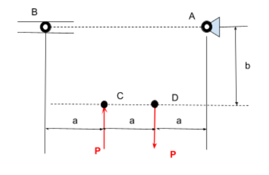
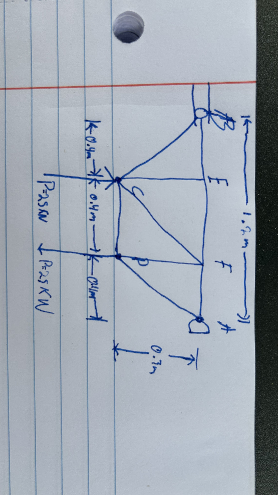
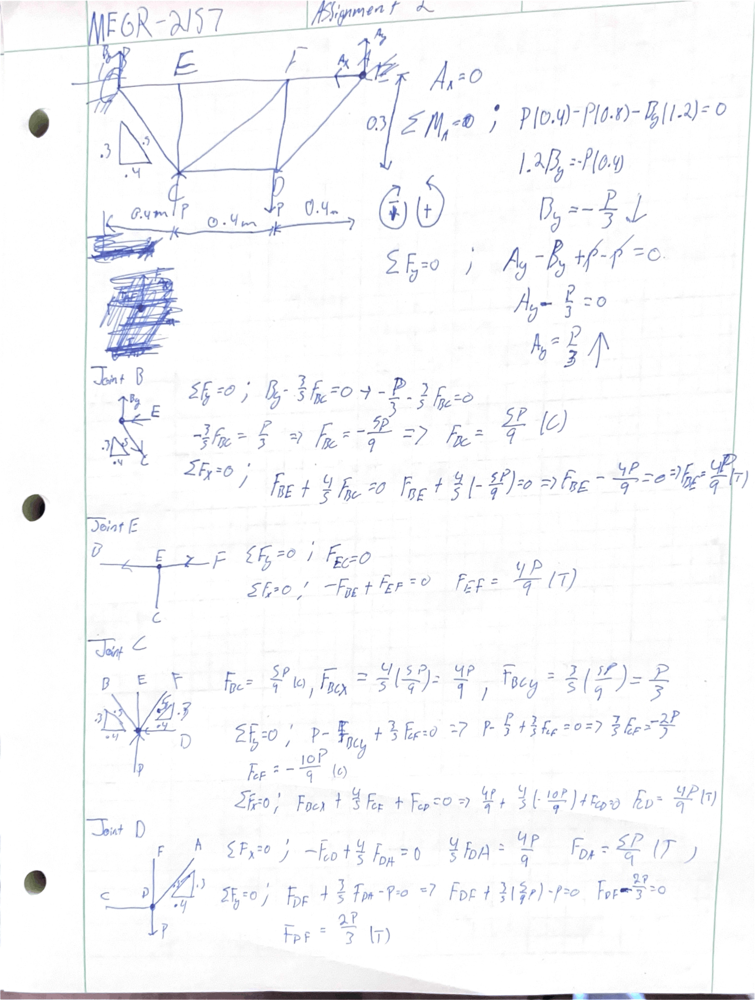
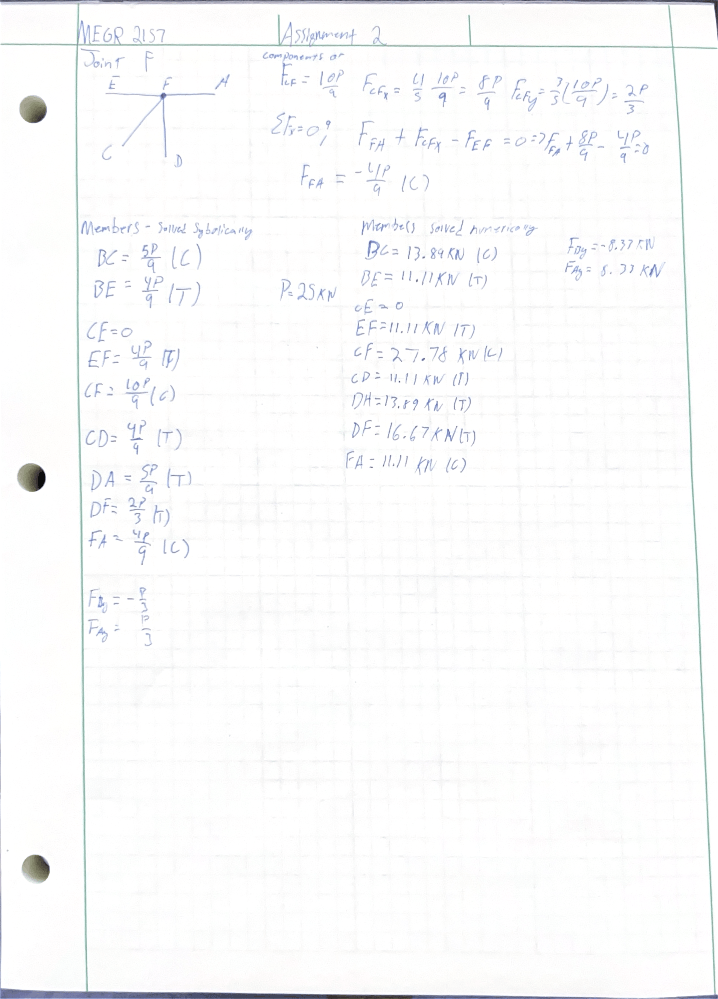
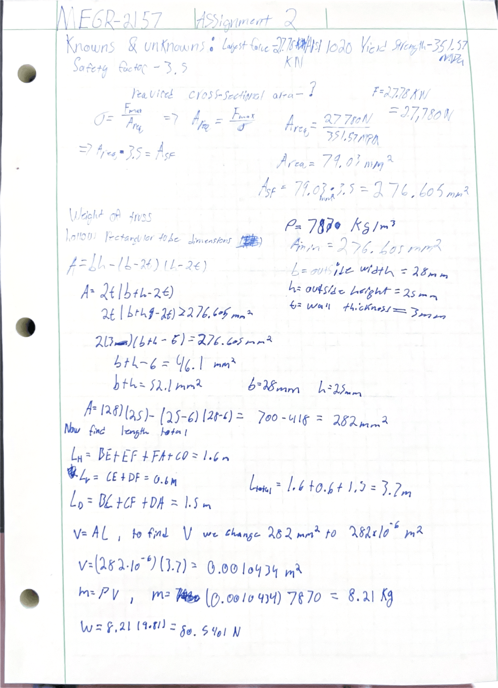

# A2 – Truss Stress Analysis

## Objective
The objective for this assignment is to design a truss, analyze the truss, determine pin sizes needed for the truss, and then model the truss in CAD software. 

## Analyze

### Design

To start we were given that point A is a pin and point B is a roller. The distances given for a is 0.4 m and for distance b it is 0.3 m. We were told to pick a value for P, I chose 25 KN. The planar truss will be designed using AISI 1020 Steel.

This is the sketch of my truss. It follows the given measurements and labels the joints. It has the load P at joint C and D. My next steps will be to symbolically and numerically solve the internal forces of the truss.

 

Initially I found the support reactions of the truss. I then symbolically solved joint B, E, C, D, and lastly F. Once I found all of the members forces symbolically I solved the members numerically using P=25 kn. I listed all the forces on the second image. Next I will calculate the required cross-sectional area.

I listed the knowns and unknowns. I used the largest force and I found the yield strength of AISI 1020 in Solidworks which was 357.57 MPa, I found the required cross sectional area. I found the formula for rectangular hollow tube. I decided to use a wall thickness of 3 mm, an outside width of 28 mm, and an outside height of 25 mm. With these dimensions I found the mass of 8.21 Kg and weight of 80.54 N

## Decide
_Which geometry did you select, and why? This is your first open design choice in the course — defend it._

## Communicate

