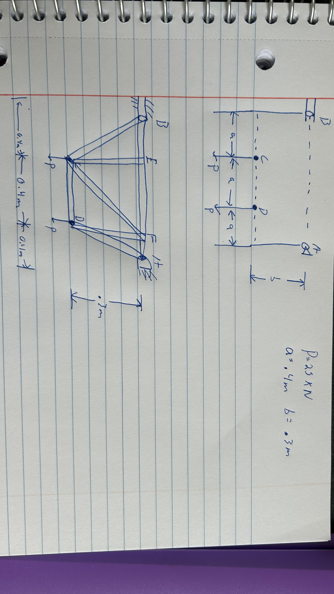

# A2 – Truss Stress Analysis

## Objective
The objective for this assignment is to design a truss, analyze the truss, determine pin sizes needed for the truss, and then model the truss in CAD software. 

## Analyze

## Decide
_Which geometry did you select, and why? This is your first open design choice in the course — defend it._

## Communicate

