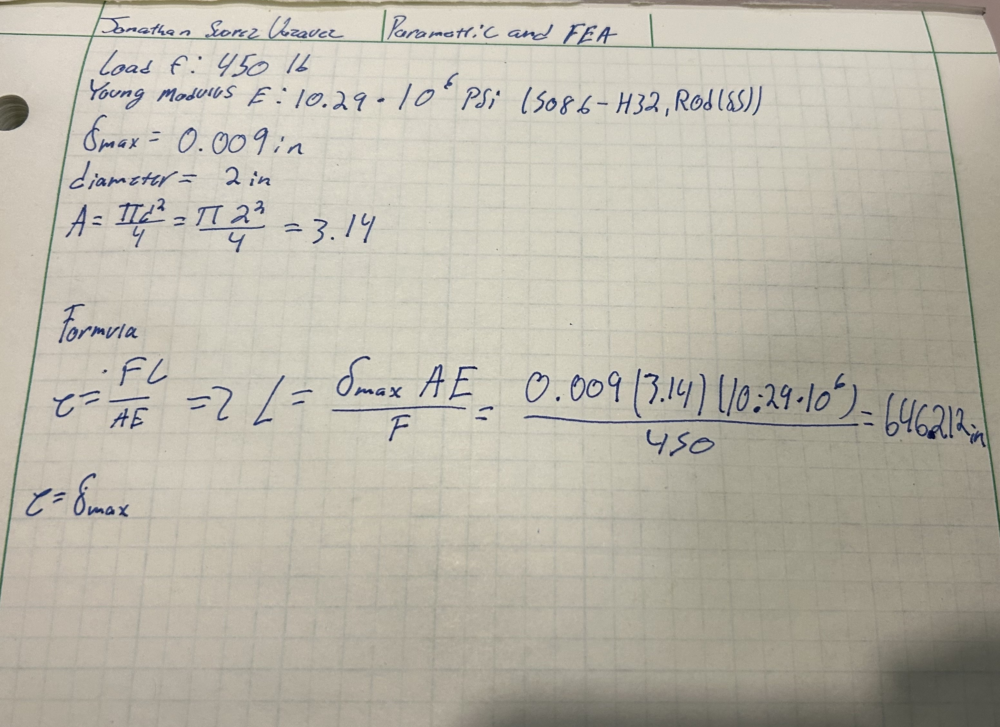

# A3 – Parametric and FEA

## Objective
The objective for this assignment is to design a bar using axial deflection modeling to find the dimensions. After that we will use parametric design to find the bars length. Then we will use a CAD software to run a Finite element analysis. We will then compare the two methods of designing. 

## Analyze
To begin the values that were given to use were δmax=0.009 in, 300lbf<f<500lbf, and a Young's Modulus from  (8.5 - 11.5) x 10^6 psi. We were told it was a circular cross sectional area. I chose the load f=450 lb, E=10.29*10^6 since I was going to use the material aluminum alloy-5086-H32, Rod(ss) in solidworks, and a diameter of 2 in. After choosing these values I found the cross-sectional area using the formula PI(d^2)/4 and it came out to 3.14 in^2. Then we were told to calculate the length using the direct tension elongation equation from the Machinery’s Handbook, e=FL/AE, after some magic tricks I found L=eAE/F. I will use δmax=0.009 in as e. After substituting the values into my equation I found the length to be 646.212 in. 

## Decide

## Communicate

