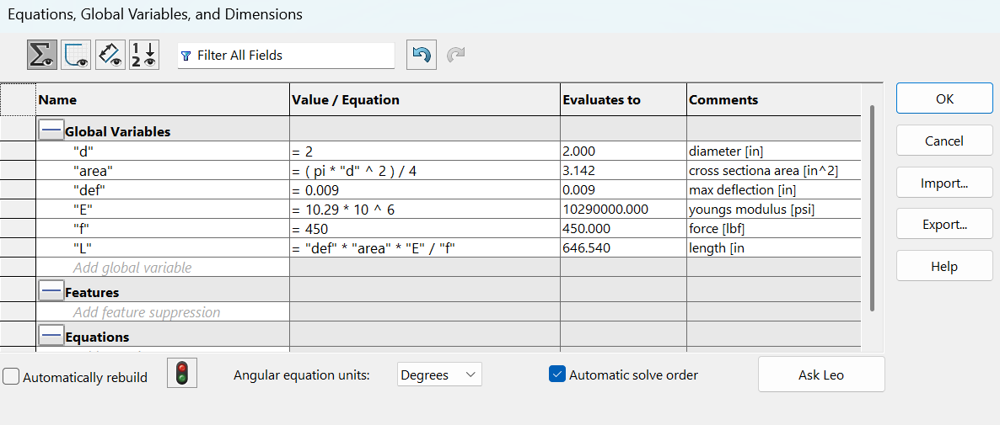
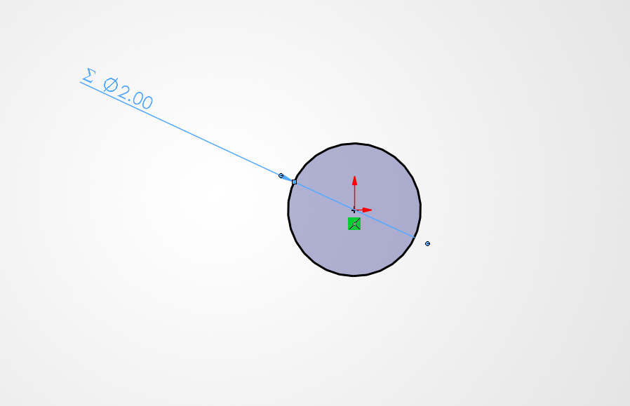
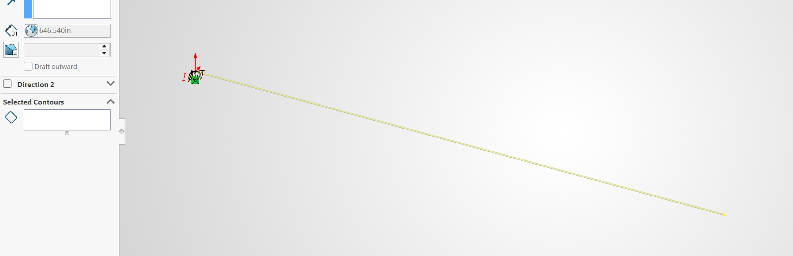
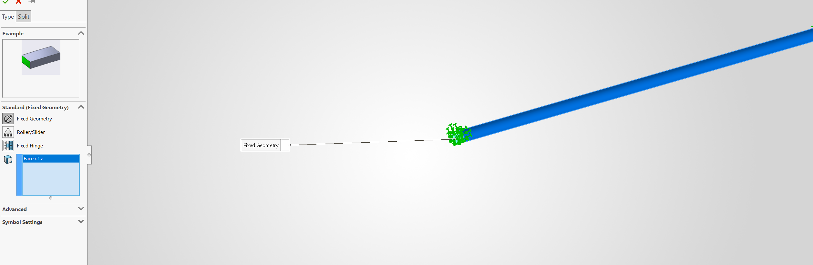
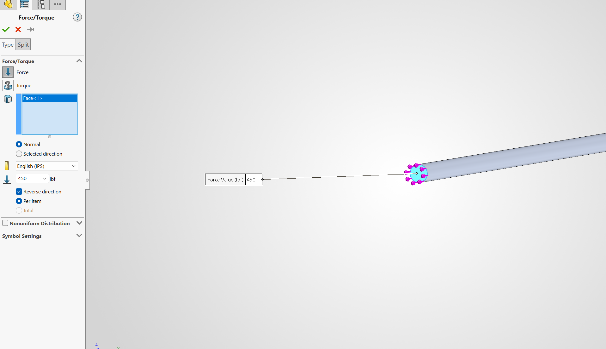
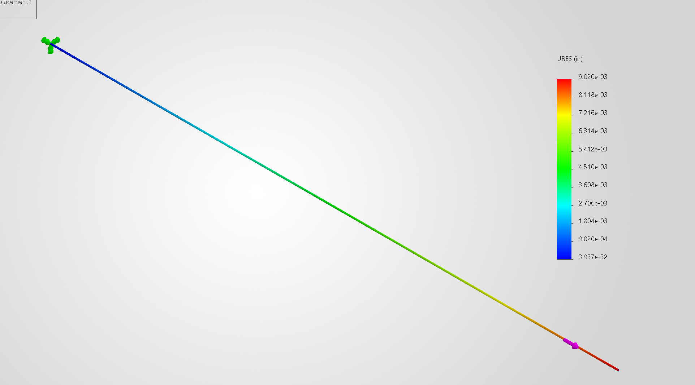
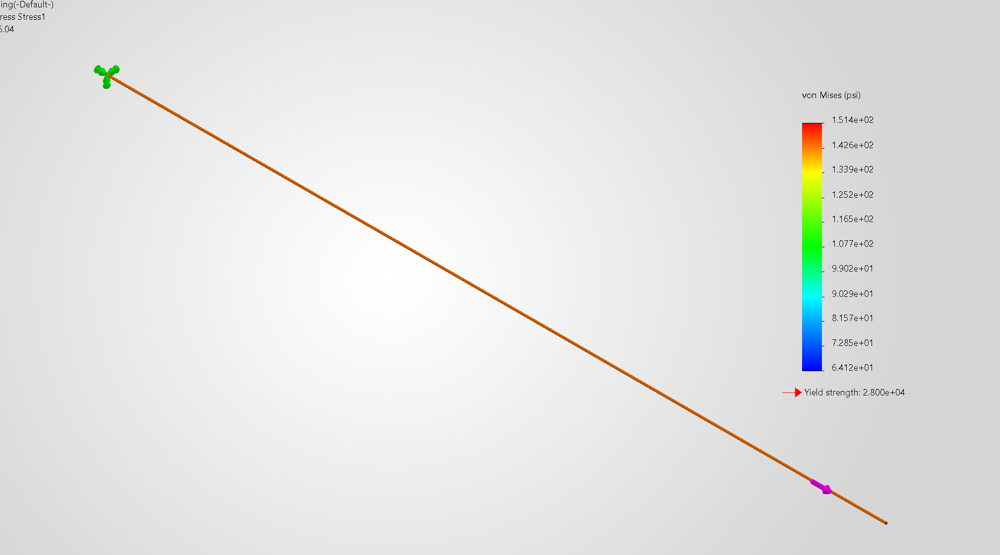

# A3 – Parametric and FEA

## Objective
The objective for this assignment is to design a bar using axial deflection modeling to find the dimensions. After that we will use parametric design to find the bars length. Then we will use a CAD software to run a Finite element analysis. We will then compare the two methods of designing. 

## Analyze

### choosing values and finding the length

To begin the values that were given to use were δmax=0.009 in, 300lbf<f<500lbf, and a Young's Modulus from  (8.5 - 11.5) x 10^6 psi. We were told it was a circular cross sectional area. I chose the load f=450 lb, E=10.29*10^6 since I was going to use the material aluminum alloy-5086-H32, Rod(ss) in solidworks, and a diameter of 2 in. After choosing these values I found the cross-sectional area using the formula PI(d^2)/4 and it came out to 3.14 in^2. Then we were told to calculate the length using the direct tension elongation equation from the Machinery’s Handbook, e=FL/AE, after some magic tricks I found L=eAE/F. I will use δmax=0.009 in as e. After substituting the values into my equation I found the length to be 646.212 in. 

 

### CAD modeling

I entered the values into the global equations in the equations tab. After entering the values I inserted the equation I found earlier L=eaAE/F into the length section to find the length which was 646.540 in. I then modeled the circular bar in Solidworks, setting the diameter equal to d and then extruded it setting the length to L. 

 

### FEA

To generate the deflection and von mises map I conducted a FEA. I fixed one of the faces and set the force (f=450lb) to the opposite face pulling the bar into tension. I then changed the units of the von Mises and displacement map to IPS units (psi, in). Using the values in solidworks, yield strength: 2.800e+04 and a stress of 1.514e+02, I found my safety factor of 184.94. This seems very high. 

### Design Reflection

The percent difference of the two is 2(0.00902-0.009)/(0.00902-0.009)=0.002220*100=0.2220% which is very close. I expect them to agree since all the values used were the same. I think the reason the values are very similar is because of the lack of any stress concentrations, the mesh being coarse leading to it being similar to the hand-calculations. I would trust the Solidworks result over the hand-calculations. The reason being that if you need to adjust any variables it is much easier to do that on the CAD software instead of recomputing it by hand. Using my machinery's handbook I found the stress-concentration factor of 3. σ(3)= 454.2 psi which is well below the yield strength 2.800e+04.  

## Decide

For the 2157 students:
I decided that I would like to make the length shorter, to do this I will keep the area the same, the young's modulus the same, and I will only change the force to 490 lbf. 

## Communicate

I learned how to use the global equations., how to correctly link dimensions, and how to generate a FEA. I spent about 4 hours on this assignment.

### CAD DOWNLOAD

[Parametric and FEA](https://1drv.ms/u/c/3f1fcb01952d5efb/IQB_DjaTWpReR49PynzQDDCrAQtbZij6yqvelXvONw8fW-Y?e=4sut0M)
