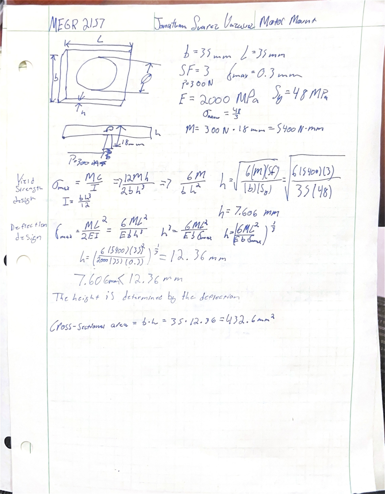
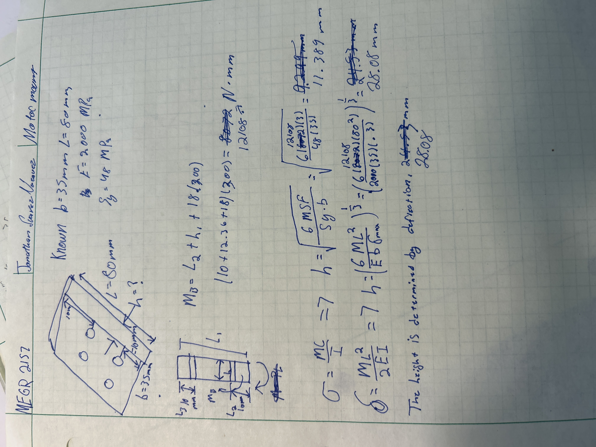
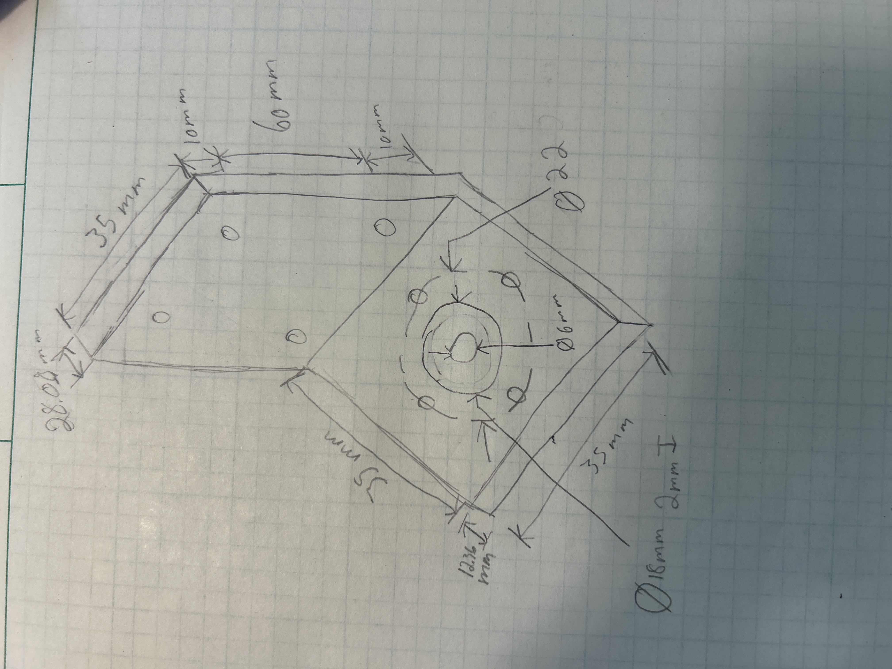

# A4 – Motor Mount

## Objective

The objective for this assignment is to design a motor mount for a [Brushed 24V DC Gear Motor](https://www.omc-stepperonline.com/brushed-24v-dc-gear-motor-3-6kg-cm-46rpm-w-99-5-1-planetary-gearbox-pa28-28245800-g100). We will model it as two features, feature 1 being a treated as a cantilever beam and feature 2 being attached to a rigid wall. For the design we will use a safety factor of 3. For both features we will first design for yield strength and then design for a maximum deflection of .30 mm at the free end. After we find the dimensions of these features we will create a sketch on paper for the design of the motor mount and then we will generate a 3D CAD model. 

## Analyze

### Motor Mount research

Initially, I examined Appendix A and B to see the dimensions of the motor and to see how the features would look like in the motor mount. The motor has a diameter that is 22 mm and four M4 screw holes. For the material we were allowed to select between ABS, PETG, or PLA. I will model my motor mount with ABS because it has a moderate tensile strength and if the motor were to be running it has good heat resistivity. 

https://www.pololu.com/product/2258

This motor mount has to welded supports at the bend of the bracket for improved reinforcement. It also includes two slots for mounting the bracket to a surface. It uses M4 screws while the motor we are designing for uses M3 screws. 

https://www.adafruit.com/product/3768?srsltid=AU7gw4UAS4LnrRnJ3lmwHriRJ0fajxNztWKxnukKCtVOwqiCcMIrIsYw

This motor mount looks similar to the one provided in appendix B but instead of mounting the motor on the end it is mounted on the side. It does not have extra supports like the other one because it would interfere with how it is fastened to the motor. 

### FEATURE 1

To begin I started with feature 1. The diameter of the motor was 28 mm so I wanted a base and length that would exceed that constraint, I also wanted it to be square so I chose 35 mm for both the b and L. I listed all my knowns, E=2000 MPa, Sy=48 MPa, the moment was 5400 N*mm because the force 300 N acting 18mm away due to it being on the end of motor's shaft. I used the equation for yield strength design σ=MC/I, I being the moment of inertia, I=bh^3/12, C=h/2. I solved for the height h, h=sqrt(6(m)(sf)/sy(b)). The height due to yield strength was 7.606 mm. I then calculated the height using the deflection equation, Def=ML^2/2EI, I being  I=bh^3/12, solving for h required the equation to become h=(6ML^2/EbDEF)^1/3. This came out to 12.36 mm. The height is determined by the deflection design. 

### FEATURE 2

The knowns are the similar to those from feature 1. b=35mm, E=2000 MPa, Sy=48MPa, L=80 mm, the height of the holes are 10 mm, the new momentum calculated was M_b= h1+L2+18(300), M=12108 N*mm. Using the same equations from the previous feature, for the height due to stress was 11.389 mm and the height due to deflection was 28.08 mm. Feature 2 height is determined by the deflection. 

### ISOMETRIC SKETCH

Using all the values I created and the values for h I calculated I was able to draw a rough sketch of what my finished motor mount will look like. 

## Decide

## Communicate

