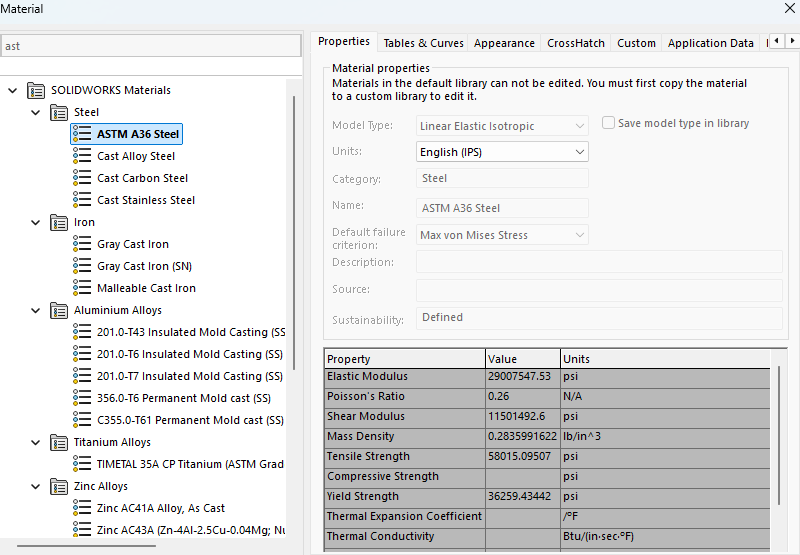
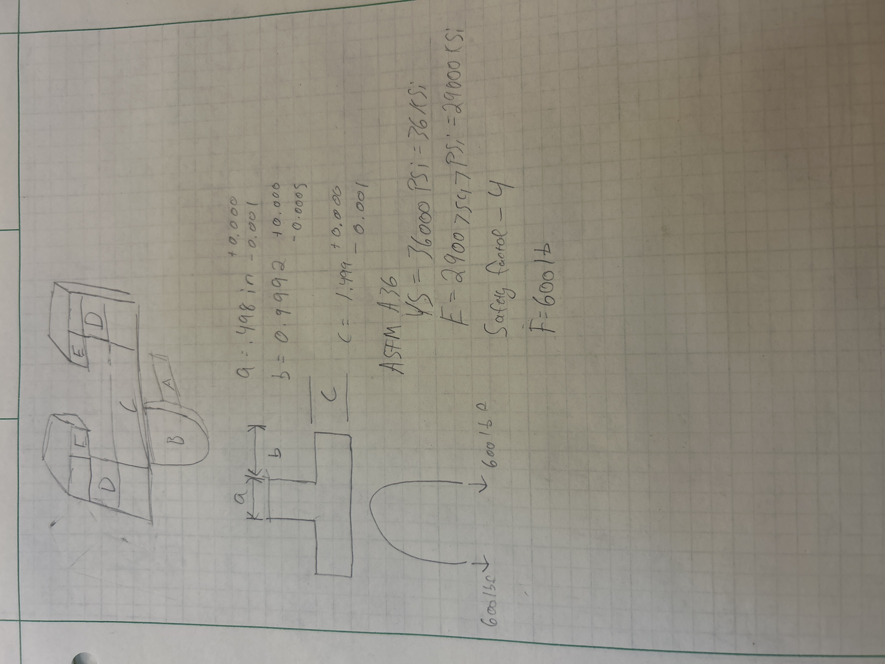
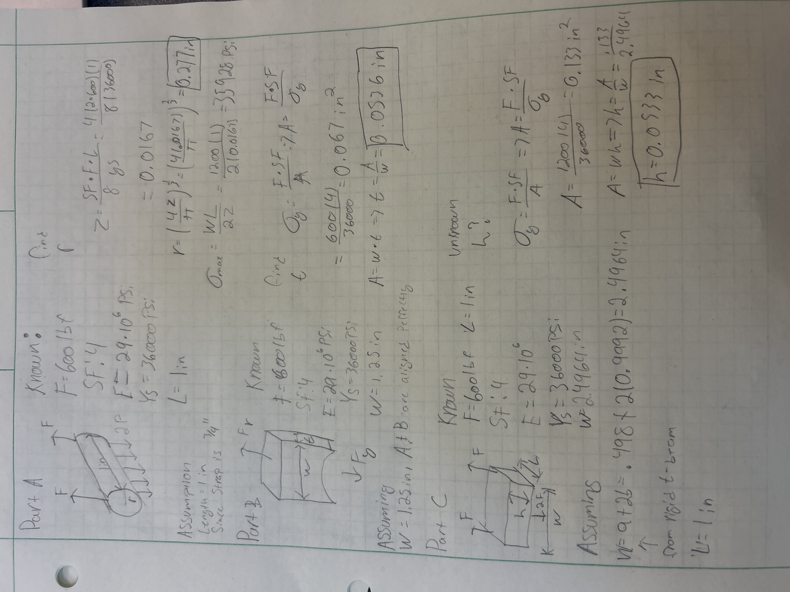
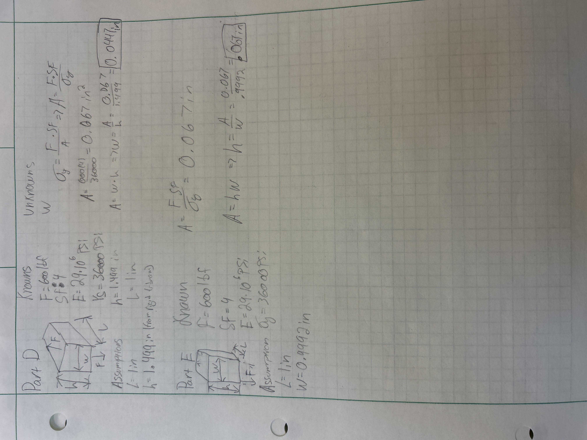
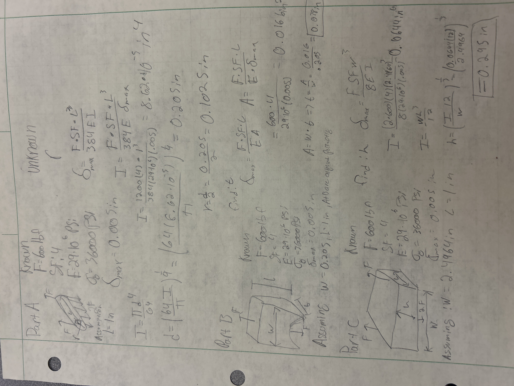
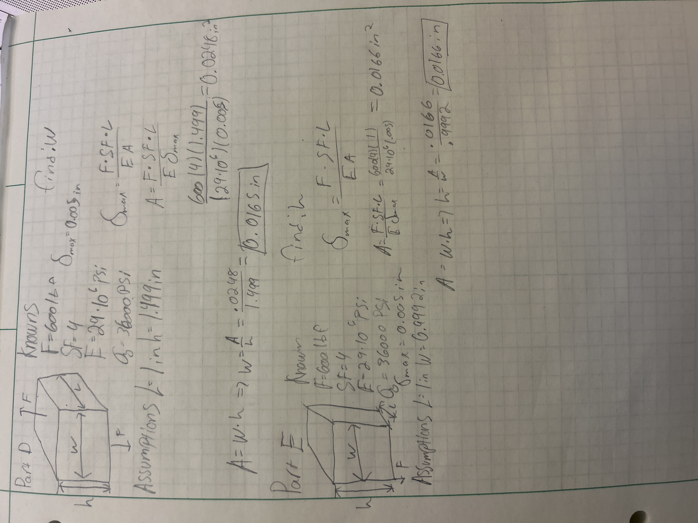
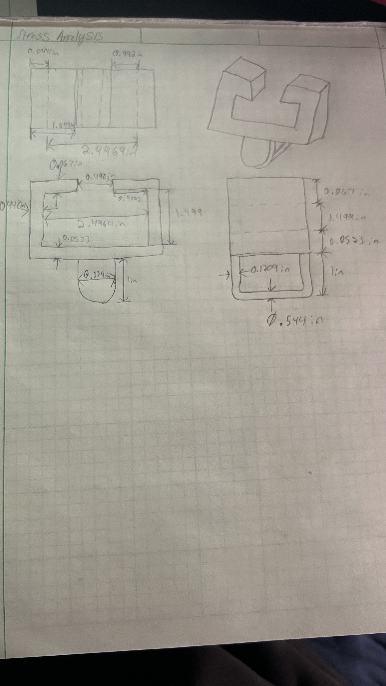
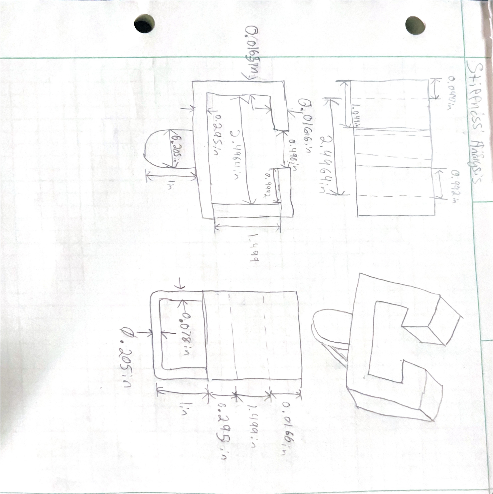
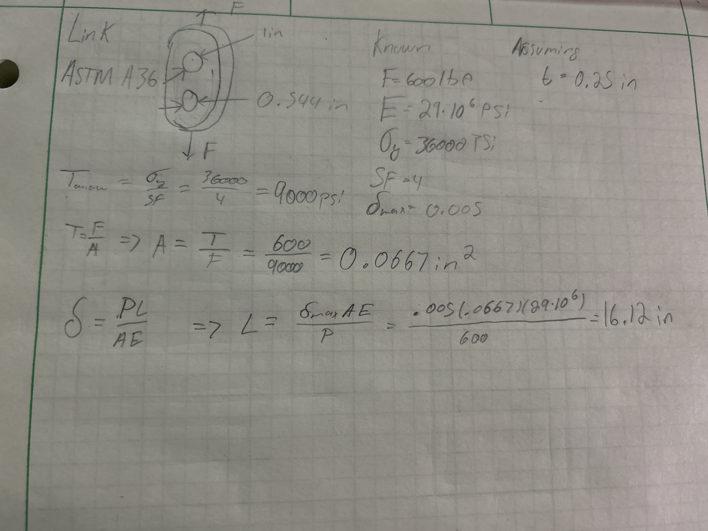

# A5 – [Bracket Design]

## Objective

The objective for this assignment is to design a bracket to hold a strap. We are given a beam to design around and we will use stress and stiffness analysis to determine our dimensions. We are also told to assume no failure due to direct shear stress. I will choose to make the bracket out of ASTM A36 steel and the load applied of 600 lbf, the safety factor is 4. I will also use the rigid t beam to define dimensions. 

## Analyze

To begin I found the Elastic Modulus and Yield strength for ASTM A36 Steel. I then sketched what the bracket would look like to break it up into 5 parts and I sketched what the bracket looked like and the dimensions so I can reference them quicker. On that same sketch I added my knowns such as my force, safety factor, and material properties.

### Stress Analysis

To begin I started with parts A, B, and C. For part a, I used the length 1 in because the [strap](https://www.uline.com/Product/Detail/S-12925/Poly-Cord-Strapping/Heavy-Duty-Polyester-Cord-Strapping-3-4-x-2500?pricode=WA9239&gadtype=pla&id=S-12925) is 3/4" so I added 1/4" for space. For parts A, B, and C I stated the values I knew and the assumptions I made as well as what I was solving for. Some of the assumptions in dimensions were made because of the Rigid T Beam and the previous dimensions. 

I then used the stress analysis to calculate the unknowns for members D and E.

### Stiffness Analysis

I used a lot of similar values and assumptions for the stiffness analysis. We were given a maximum deflection of 0.005 in. For part A I used the Fixed-Fixed beam. 

### Multiview sketches

Stress Analysis Multiview

Stiffness Analysis Multiview

### 2157 students

I found the dimensions of the link we were tasked with designing. I used the stress equation to determine the required cross-sectional area of the smaller hole. I then found the length of the linkage. 

## Communicate

The diameter of part A is governed by stress. The minimum diameter because of stress was 0.544 in vs the diameter due to deflection which was 0.205 in. Choosing the stress diameter ensures the metal doesn't fail due to yield and it is plenty thick enough to where it won't deflect more than the 0.005 in. For part B I chose the wrong width originally, I should have made it the same width as the diameter of part A. I caught this mistake when I was doing the stiffness analysis and realized I could change my width to match part A, I went back and fixed it for the stress analysis. If the assumption that it does not fail due to direct shear stress was incorrect than some of the dimensions may have to be changed since that introduces a new mode of failure that we would need to account for. 

This assignment took me 5 hours to complete. 

