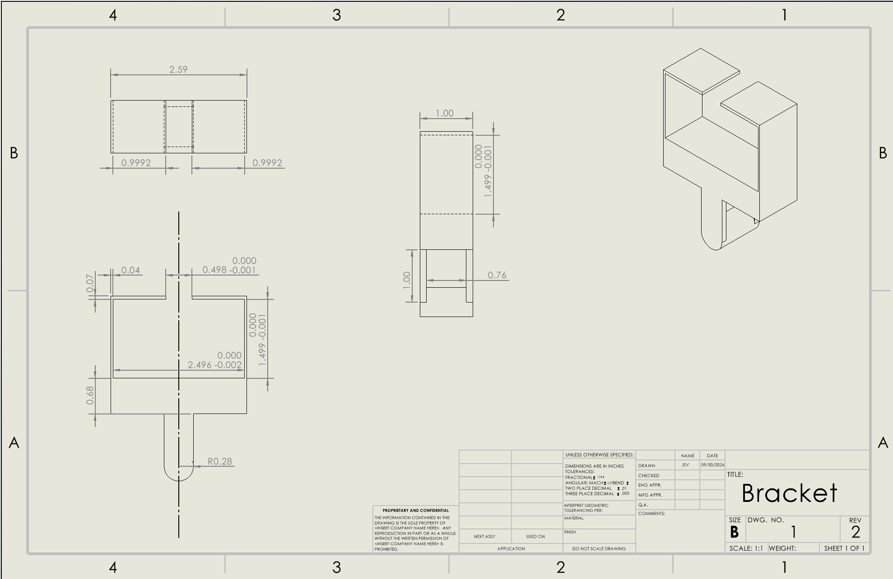

# A6 – [Bracket Drawing]

## Objective

The objective for this assignment is to generate a comprehensive solid model and a multi-view engineering drawing from the bracket we designed last week. I will use dimensions from both the strength and stiffness analysis to ensure that both requirements are met. 

## Analyze

To begin I analyzed both of my sketches to decide what dimensions from either analysis I would like to use. I will choose the bigger dimension to ensure that the part will not fail due to the strength or due to the stiffness. 

I opened solidworks and entered my values in the global equations. I also chose the material ASTM A36 so I selected that material in solidworks. 

I made a sketch of the bracket to begin and entered the values from the equations table. 

I then extruded it and the part was basically finished.

I then chose the option in files "Make drawing from part". 

I added a centerline to the front view to show that the dimensions even though may only be on one side they apply to both sides. I also added the tolerances from the rigid t-beam so that it will fit smoothly.

## Decide

## Communicate

