# A6 – [Bracket Drawing]

## Objective

The objective for this assignment is to generate a comprehensive solid model and a multi-view engineering drawing from the bracket we designed last week. I will use dimensions from both the strength and stiffness analysis to ensure that both requirements are met. 

## Analyze

### Fits

RC4 fit for a diameter of 0.554 is +0.001 and -0.000, for the shaft it is -0.0006 and -0.0013. 

FN1 fit for a diameter of 1 in is +0.0012 and -0.000. 

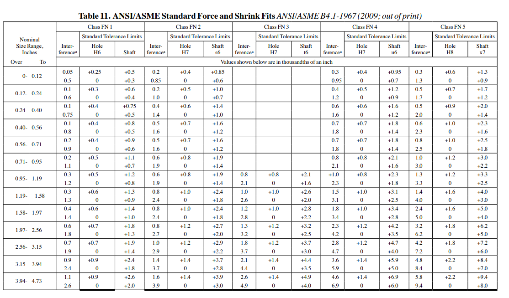
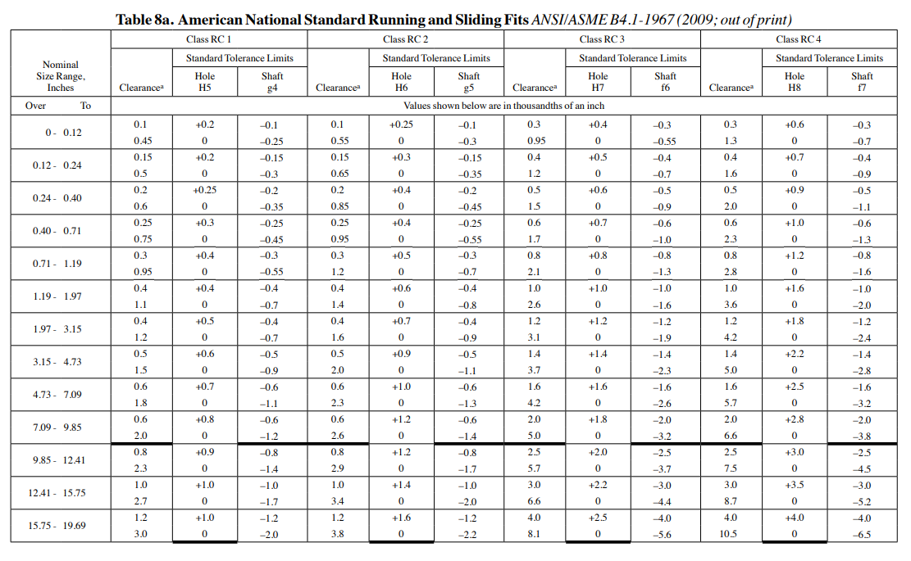

### Bracket Modeling
To begin I analyzed both of my sketches to decide what dimensions from either analysis I would like to use. I will choose the bigger dimension to ensure that the part will not fail due to the strength or due to the stiffness. 
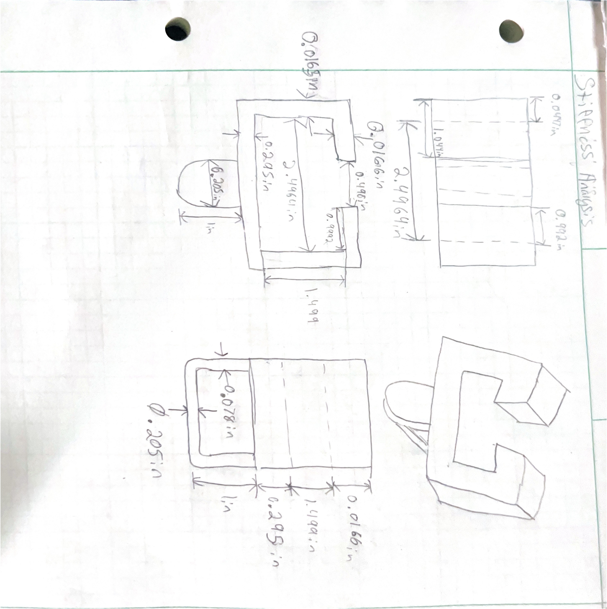
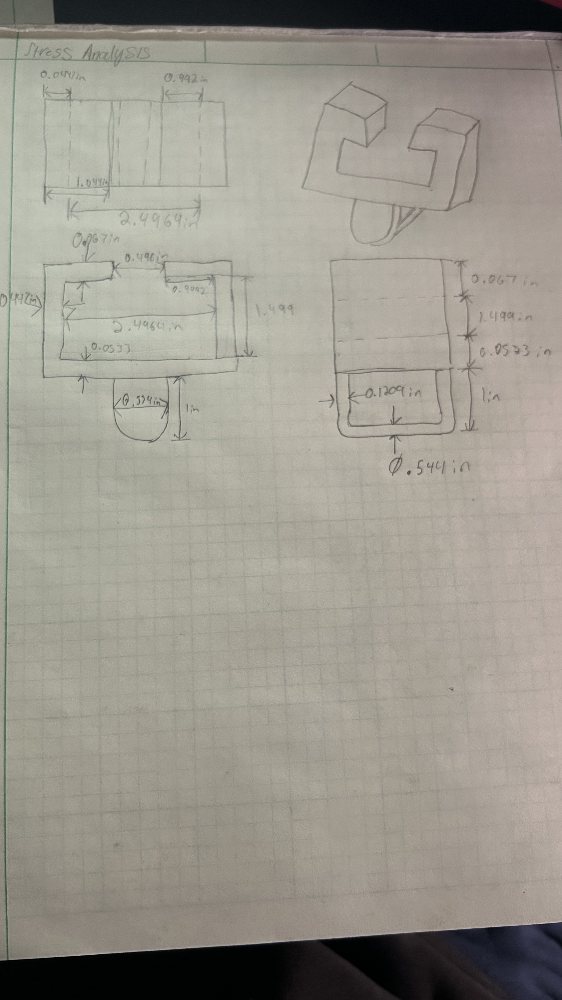

I opened solidworks and entered my values in the global equations. I also chose the material ASTM A36 so I selected that material in solidworks. 

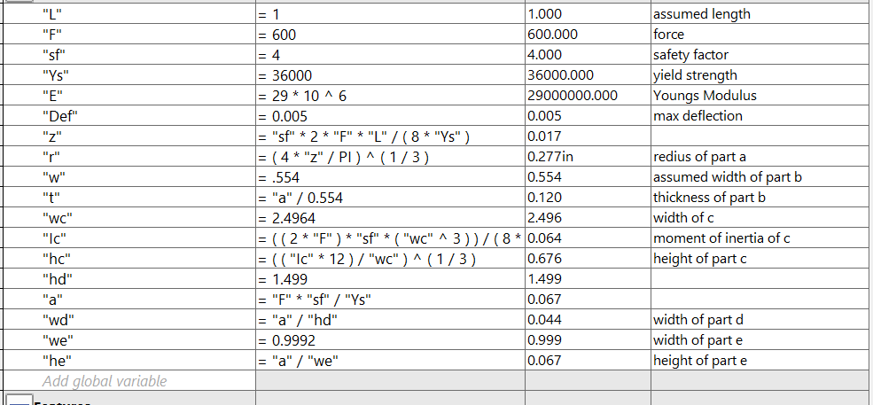

I made a sketch of the bracket to begin and entered the values from the equations table. 

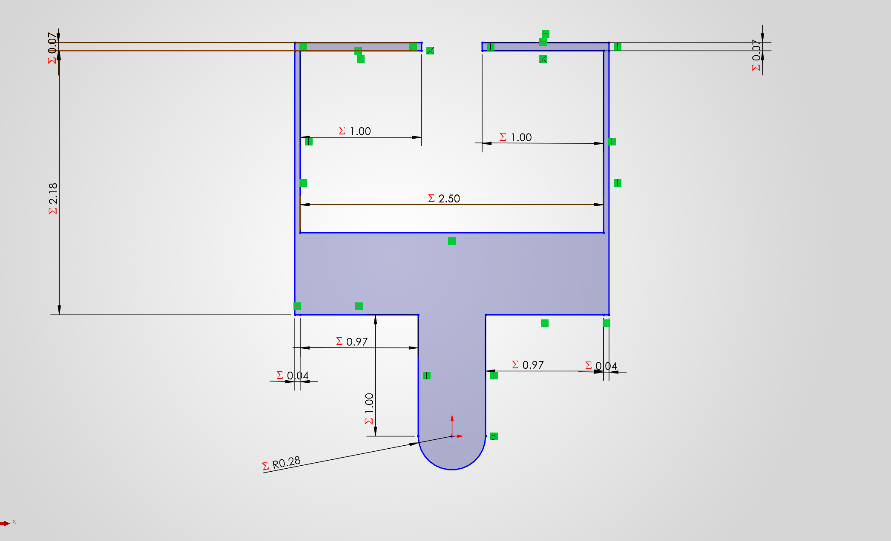

I then extruded it and the part was basically finished.

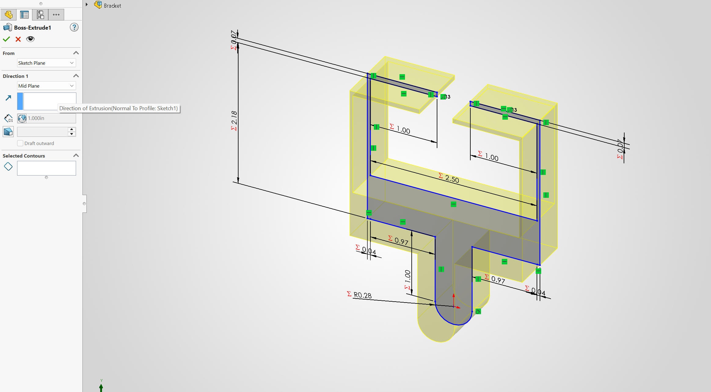
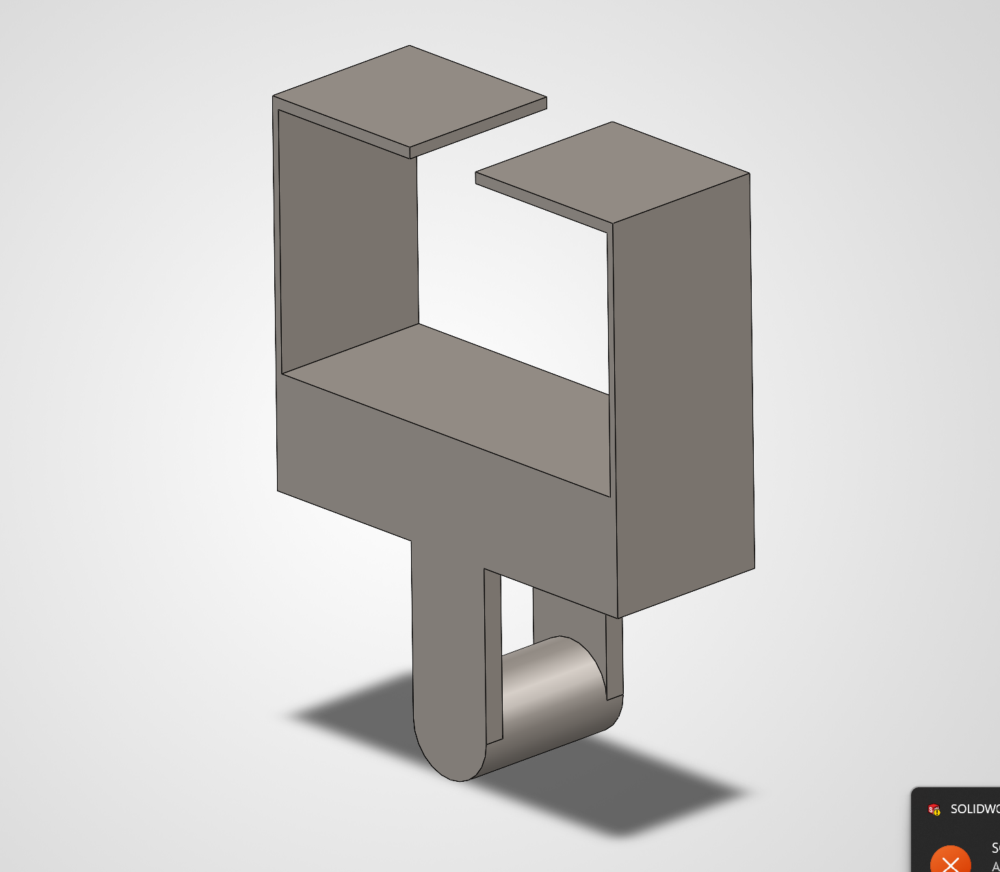

### Bracket Drawing

I then chose the option in files "Make drawing from part". 

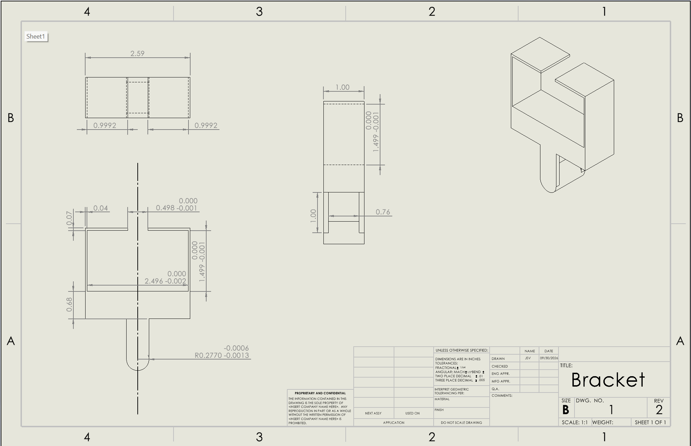

I added a centerline to the front view to show that the dimensions even though may only be on one side they apply to both sides. I also added the tolerances from the rigid t-beam and the fit from the link so that it will fit smoothly.

### Link

To begin I also entered the values from my link into the solidworks global equations. 

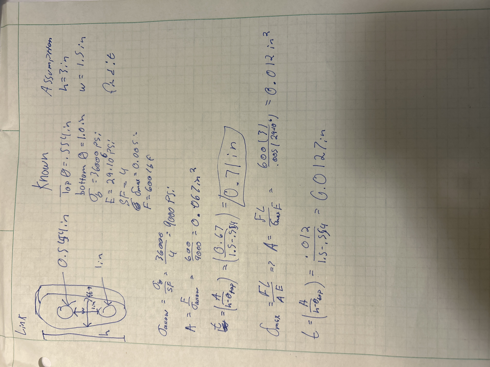
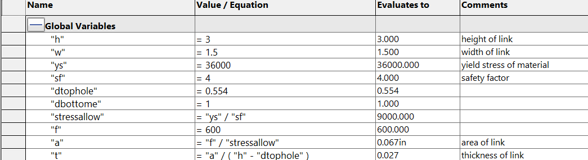

After I sketched the link and extruded it. 

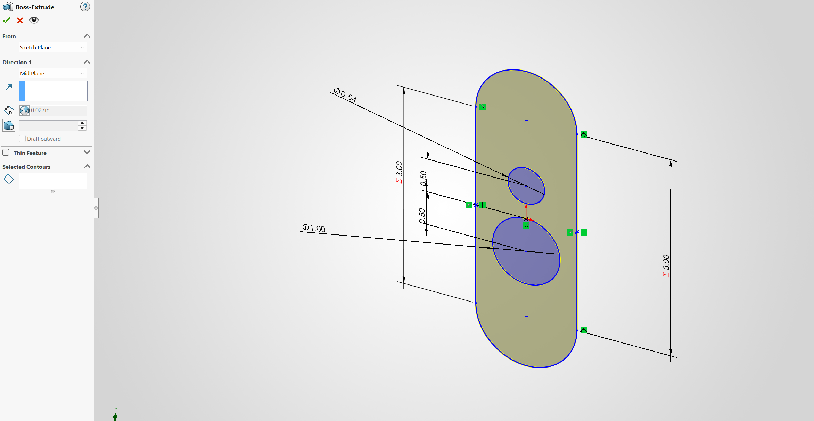

I then created a drawing and added the dimensions. I also added the tolerances from the sliding fit and the light pressure fit. 

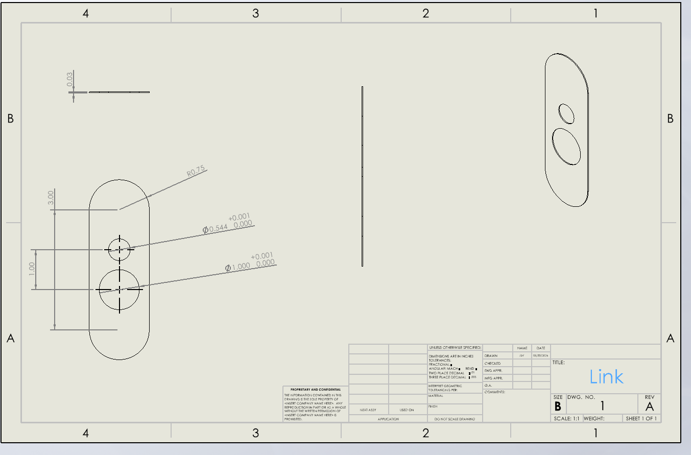

## Communicate

I chose the stress driven radius for part A. I used the equation r=4Z/pi and I calculated Z=SF*2F*L/8Ys. I was able to enter this into solidworks. I did not change any values so I got the same value as my calculations from the last assignment. I added tighter tolerances for part A because it has a sliding fit driven dimensions due to the link I was tasked with designing. I also added the tolerances from the rigid T beam so that it will fit correctly. 

This assignment took me 3 hours.

[Bracket](https://1drv.ms/u/c/3f1fcb01952d5efb/IQDTLF5dsNoiQp5yY80qsCDBAZEyf0kPrC31BWFqRWMAcGw?e=ZTXF5W)

[Bracket Drawing](https://1drv.ms/u/c/3f1fcb01952d5efb/IQDVFP5OKk5WRIcrjWj71wQxAS6veWN3H78QkM0B_AGawTY?e=Bjf549)

[link](https://1drv.ms/u/c/3f1fcb01952d5efb/IQBVRse-T3-9R7sGSsghsh4EAefOseN2hoOvw_J5drr8nB0?e=wQOesq_)

[link drawing](https://1drv.ms/u/c/3f1fcb01952d5efb/IQCZ_fG_Lvf9S6lcXprRHoxFAWqNTj5QoK4A-Ih0ASVyQs8?e=cUyHgs)
